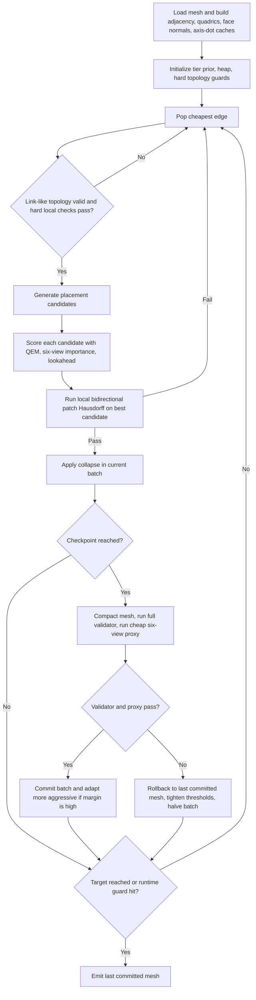

# Improving Compression of a Passing QEM Mesh Simplifier

## Executive summary

Your current uploaded solver is already on the right algorithmic family: it is a greedy, priority-queue, edge-collapse simplifier with area-weighted quadrics, curvature-sensitive costs, size-tiered target counts, cost caps, and a stricter scalar cluster-radius guard than the earlier neighbor-only version. In the newer file, it also introduces near-planar region detection and discounts planar interior edges aggressively, which is exactly the sort of engineering that makes a QEM-based simplifier pass validity tests while staying fast. That is a strong baseline, and it explains why the code is reliable. fileciteturn0file0 fileciteturn0file1

The main conclusion from the literature and from existing implementations is that you should **not replace** this with reinforcement learning, dynamic programming, or an entirely different simplifier. The winning direction is to keep the current greedy QEM core and add four things, in this order: **multi-candidate vertex placement**, **a local bidirectional patch Hausdorff proxy**, **cheap six-view importance weighting tuned to the contest’s normal/depth SSIM**, and **adaptive target scheduling with rollback at checkpoints**. This is consistent with how CGAL and libigl organize simplification around customizable cost, placement, and expensive late-stage filters, and it is consistent with recent work that improves QEM by adding feature-aware terms, normal consistency, and better handling of weak features rather than abandoning edge-collapse simplification. citeturn14view0turn15view0turn10academia2turn10academia3turn18academia0

If I had to choose one practical stack to move a passing ~60/100 solver toward the ~90/100 range, it would be this: keep the current edge-collapse heap and topology guards; add **5-way candidate placement** `{QEM optimum, projected-to-segment QEM point, midpoint, endpoint A, endpoint B}`; use the existing O(1) cluster-radius guard as a first filter and then run a **small local bidirectional patch-distance check** only on promising candidates; add a **six-view importance multiplier** that raises costs around silhouette-sensitive, normal-sensitive, and depth-sensitive regions; and replace fixed hard-coded target ratios with a **checkpointed adaptive controller** that becomes more aggressive only when a cheap six-view proxy stays safely above the margin. That stack has the best expected compression gain per unit of risk. fileciteturn0file0 citeturn14view0turn15view1turn5academia1turn11academia0turn11academia1turn6academia1

Yes, this also means you now have **many hyperparameters**. In practice, that is normal here. The literature on derivative-free optimization strongly supports treating this as a black-box tuning problem: Optuna is very strong for mixed, conditional search spaces; Bayesian optimization is excellent in lower-dimensional continuous spaces; and CMA-ES is especially strong once you have reduced the search to a mostly continuous, nonconvex set of high-value parameters. For this problem, the recommended workflow is **Optuna/TPE to discover a good regime, then CMA-ES to refine the continuous weights**. citeturn7academia2turn7academia0turn8academia0

## Baseline diagnosis

The current uploaded `v2` solver does several things well. It computes face-plane quadrics weighted by triangle area, sums them at vertices, and greedily collapses the lowest-cost edge from a priority queue. It adds curvature and edge-length weighting, uses a union-find pass to identify near-coplanar faces, discounts collapses on planar interior edges more aggressively than planar boundary edges, and stops through both target tiers and size-dependent cost caps. It also adds a scalar cluster-radius Hausdorff guard,
which is explicitly described in the file header as a stricter replacement for the earlier neighbor-only guard. These are all good reasons it passes reliably. fileciteturn0file0

The earlier file is simpler: it still uses greedy QEM, curvature, edge-length weighting, fixed target tiers, and a neighbor-distance guard, but it lacks the newer planar DSU logic and the cluster-radius accumulation. That comparison matters because it clarifies what has already been learned empirically: **aggressive QEM alone scored better, but adding the stricter geometric guard and planar handling made the simplifier robust enough to pass all tests**. fileciteturn0file0 fileciteturn0file1

The present score ceiling is therefore not coming from “wrong overall algorithm.” It is coming from the fact that the current ranking and acceptance logic are still mostly **geometry-only and locally hand-weighted**. The code does not yet directly optimize the contest’s perceptual objective, which is based on multiple rendered views and SSIM-like scoring over depth and normals. In other words, your solver is already excellent at “avoid invalid output” and “avoid gross geometry drift,” but it is still underusing the available headroom in regions that are geometrically safe yet visually unimportant. That is exactly the sort of gap that recent QEM extensions, weak-feature-preserving formulations, and view-aware perceptual signals are meant to close. fileciteturn0file0 citeturn10academia2turn18academia0turn5academia1turn11academia0

There is also a structural reason to stay with greedy edge collapse. CGAL’s surface-mesh-simplification package and libigl’s decimation tutorial both still revolve around the same core pattern: **edge collapse ordered by cost, user-supplied placement and cost policies, late invalidation of expensive conditions, and local cost updates after accepted collapses**. Libigl explicitly emphasizes the mutual-neighbor topology condition for preserving topology under edge collapse, and CGAL explicitly treats expensive envelope-style tests as late filters rather than part of the always-on priority metric. That matches your contest setting very well: a fast local ranking core, plus rarer expensive filters only when they buy more compression safely. citeturn14view0turn15view0turn15view1

## Literature and implementation survey

The most useful modern reading is not a search for a radically new paradigm; it is a search for **what recent work adds on top of QEM**. Recent examples include **CWF** in 2024, which addresses the classical QEM weakness on weak features by combining a normal-anisotropy term with a CVT-style regularization term, and **FA-QEM** in 2026, which explicitly adds geometric deviation, boundary curvature, and surface-normal consistency to make QEM more robust on modern generated and scanned assets. A related 2024 paper on quad-dominant reduction shows that dihedral-angle-weighted quadrics and careful ordering among near-equivalent collapses can noticeably improve shape preservation without abandoning single-edge collapse. These works all reinforce the same message: if you want more compression from a QEM pipeline, you usually improve **the cost model, the placement, and the feature terms**, not the basic collapse engine. citeturn10academia2turn18academia0turn18academia1

That same pattern appears in mature implementations. CGAL exposes cost, placement, and placement-filter policies and includes recent probabilistic and line-quadric variants in its Garland–Heckbert strategy family. Libigl exposes a function-handle interface for custom cost-and-placement and uses a priority queue with lazy invalidation and local updates, while also providing AABB-accelerated point-mesh distance queries that are useful for offline or checkpoint-based geometric tests. The widely used Fast-Quadric-Mesh-Simplification repository shows the opposite engineering trade-off: it uses thresholding instead of full sorting to get speed, but it also warns that that choice can reduce quality and performs best on watertight meshes without thin sections. For your contest, that is a cautionary example: speed-only shortcuts are probably not where the remaining score lives. citeturn14view0turn15view0turn15view1turn16view3

Recent literature also supports adding **perceptual and viewpoint-sensitive guidance**. A 2024 subjective study on dynamic mesh LOD in VR found that perceived quality depends strongly on viewpoint and object distance, not just triangle count. A 2024 textured-mesh saliency paper and a 2026 VR saliency-ground-truth paper both emphasize that attention is distributed across viewpoints and that topologically consistent, multi-view saliency estimation matters. In your setting, the contest explicitly scores rendered views, so these results matter even if you do not build a full saliency model: they justify adding a very cheap six-view proxy that treats silhouette sensitivity, projected area, normal deviation, and depth shift as first-class signals. citeturn5academia1turn11academia0turn11academia1

For quality measurement, the most relevant perceptual background is SSIM. The modern review “A Hitchhiker’s Guide to Structural Similarity” is valuable not because you need a textbook SSIM implementation in the simplifier, but because it shows that implementation details matter and that a quality proxy should be kept consistent and computationally manageable. That supports the design choice to use a cheap, fixed six-view proxy **only at checkpoints**, instead of trying to fold expensive rendering into every single edge evaluation. citeturn6academia1

On hyperparameter search, the strongest practical sources are the Optuna paper, the Optuna project documentation, the original Bayesian optimization paper by Snoek et al., BOHB for robust parallel tuning, and Hansen’s CMA-ES tutorial. Together they point to a pragmatic workflow: Bayesian/TPE-style search to explore a mixed and conditional parameter space; successively more faithful evaluations for promising configurations; and CMA-ES once the search space has been narrowed to a stable, mostly continuous set of weights and thresholds. That workflow translates directly to your problem because your objective is noisy, black-box, discontinuous at validity failures, and expensive enough that you should not waste high-fidelity evaluation on clearly poor settings. citeturn7academia2turn17view0turn7academia0turn7academia3turn8academia0

## Ranked techniques and algorithmic recipes

The table below is an **engineering estimate** of what is most worth adding to the current passing solver. The estimated compression deltas are best read as **additional removable-vertex percentage points at similar failure probability**, not as guaranteed improvements. They are anchored to the current code structure and to the behavior of the cited literature and implementations. fileciteturn0file0 citeturn14view0turn15view0turn10academia2turn18academia0

| Technique | Expected compression delta | Risk of constraint failure | Implementation complexity | Runtime multiplier |
|---|---:|---|---|---:|
| Multi-candidate vertex placement | +2 to +6 pp | Low | Low to medium | 1.05x to 1.20x |
| Local bidirectional patch Hausdorff proxy | +2 to +6 pp | Low if checkpointed | Medium | 1.10x to 1.40x |
| Six-view importance weighting in edge cost | +3 to +8 pp | Low to medium | Medium | 1.03x to 1.15x |
| Adaptive size-tiered target scheduling | +2 to +7 pp | Medium if untuned | Low | 1.00x to 1.05x |
| Rollback and checkpoint controller | +0 to +3 pp direct, large indirect benefit | Very low | Medium | 1.05x to 1.25x |
| One-step lookahead cost estimate | +1 to +4 pp | Low to medium | Medium | 1.10x to 1.30x |
| Small exported decision tree for risk multiplier | +1 to +4 pp after offline training | Low if used as multiplier only | Medium | 1.01x to 1.05x |
| Line or feature-aware quadric extension | +2 to +5 pp | Medium | Medium to high | 1.05x to 1.20x |
| Full low-res proxy render after every collapse | Small direct gain | Low | High | 2.0x to 10.0x |
| Heavy continuous weak-feature functional like CWF | Potentially strong quality | High for contest integration | High | 5x+ |

### Multi-candidate vertex placement

This is the safest first upgrade because it changes only **where** a valid collapse lands, not whether the connectivity operation itself is legal.

Use the following candidate set, in this exact order:

1. `p0`: unconstrained QEM optimum from the summed quadric.
2. `p1`: projection of `p0` onto the edge segment `[v1, v2]`.
3. `p2`: midpoint.
4. `p3`: endpoint `v1`.
5. `p4`: endpoint `v2`.

The recipe is:

```text
for each edge e=(v1,v2):
    candidates = [qem_opt, project_to_segment(qem_opt), midpoint, v1, v2]
    best = INF
    for p in candidates:
        if fails cheap topology or normal-flip check: continue
        hd = local_patch_bidirectional_hd(old_patch, new_patch(p))
        look = one_step_lookahead(p)
        imp = six_view_importance(e, p)
        score = qem_cost(p) * imp + λ_hd * hd/H + α * look
        choose min score
```

Important implementation notes:

- Run all five candidates only for edges in the **best heap quantile** or for edges whose feature score exceeds a threshold. For boring planar interior collapses, `p0` and `p1` are usually enough.
- Prefer `p1` over `p0` when the unconstrained optimum leaves the segment by a large amount or when the local patch becomes numerically skinny.
- Keep the current hard guards unchanged. Multi-candidate placement should **not** weaken topology rules; it should only improve placement among already legal collapses.

This upgrade is justified both by the QEM literature embodied in CGAL’s cost/placement split and by your current code structure, which already solves a QEM position and would naturally support evaluating a handful of alternatives. citeturn14view0turn15view0 fileciteturn0file0

### Local bidirectional patch Hausdorff proxy

Your current scalar cluster-radius guard is a great coarse filter, and I would keep it. The next step is to add a **small local surface-to-surface test** only after an edge has already passed the cheap filters. That follows the CGAL design philosophy of applying expensive tolerance-like tests late, and libigl’s AABB support shows the standard building block for point-to-mesh distance queries. citeturn14view0turn15view1

The recommended old/new patch construction is:

- `old_patch`: all faces incident to `v1` or `v2`, excluding the two faces deleted by the collapse.
- `new_patch(p)`: the same patch after simulating the merge at placement `p`, with degenerate triangles removed.

Use a **bidirectional** local max-distance check:

\[
d_{\text{loc}}(p)=\max\Big(
\max_{x\in S(old)} \operatorname{dist}(x,new\_patch(p)),
\max_{y\in S(new)} \operatorname{dist}(y,old\_patch)
\Big)
\]

Recommended sampling:

- Default: **7 samples per triangle**  
  `[(1/3,1/3,1/3), (1/2,1/2,0), (1/2,0,1/2), (0,1/2,1/2), (0.6,0.2,0.2), (0.2,0.6,0.2), (0.2,0.2,0.6)]`
- Risky candidate or high-curvature patch: **13 samples per triangle** by adding vertices and three near-vertex points such as `(0.8,0.1,0.1)` permutations.
- Very large patch: fall back to **4 samples per triangle** and only promote to 13 if the cheap score is near acceptance.

Recommended thresholds relative to the global bound \(H = 0.05 \cdot \text{diag}\):

- Flat planar interior: `τ_local = 0.30 * H`
- Smooth non-planar region: `τ_local = 0.22 * H`
- High-curvature or silhouette-sensitive region: `τ_local = 0.15 * H`

Also reject immediately if any new triangle area falls below `1e-12 * diag^2` or if any affected face normal flips by more than about `75°` in smooth regions or `45°` in already sharp regions.

For patch sizes below roughly 32 to 64 triangles, brute-force point-to-triangle distance is usually cheaper than building a local BVH. Only build a tiny local AABB tree when the patch is unusually large or when you reuse it across multiple candidate placements. citeturn15view1

### Six-view importance weighting

This is the most contest-specific improvement because the stated objective depends on six rendered views and a normal/depth SSIM threshold. The point is not to do expensive full rendering per edge. The point is to add a **cheap view-aware multiplier** to the QEM cost so that the solver preserves exactly the regions most likely to damage the final metric. Recent perceptual studies and saliency work justify weighting by viewpoint, multi-view attention, and perceptual prominence rather than pure geometry alone. citeturn5academia1turn11academia0turn11academia1turn6academia1

For the six axis views \(A=\{\pm X,\pm Y,\pm Z\}\), precompute for each face `f`:

- area `A_f`
- unit normal `n_f`
- the six dot products `n_f·a`

For each candidate collapse, compute four cheap quantities:

**Projected-area importance**

\[
P(e)=\frac{1}{6}\sum_{a\in A}\sum_{f\in star(e)} A_f \max(0,-n_f\cdot a)
\]

This is a proxy for how much front-facing area the local patch presents to the six cameras.

**Silhouette sensitivity**

For the two faces adjacent to the collapsed edge, with normals `nL,nR` and edge length `ℓ`:

\[
S(e)=\max_{a\in A}
\left[
\ell\cdot
\frac{\exp(-|n_L\cdot a|/\sigma_s)+\exp(-|n_R\cdot a|/\sigma_s)}{2}
\cdot
\left(1+\frac{1-n_L\cdot n_R}{2}\right)
\right]
\]

Use `σ_s ≈ 0.20`. This becomes large near likely silhouettes and visible creases.

**Normal sensitivity**

\[
N(p)=\max_{f\in affected} \frac{\arccos(\mathrm{clamp}(n_f^{old}\cdot n_f^{new},-1,1))}{\pi}
\]

**Depth sensitivity**

\[
D(p)=\max_{a\in A}\frac{\max(\,|(p-v_1)\cdot a|,\ |(p-v_2)\cdot a|\,)}{H}
\]

Then define

\[
I_6(e,p)=1+\lambda_{sil} S(e)+\lambda_{proj}\widetilde{P}(e)+\lambda_{norm}N(p)+\lambda_{depth}D(p)
\]

where \(\widetilde{P}\) is normalized by local one-ring area or by `diag^2`.

A strong default is:

- `λ_sil = 0.8`
- `λ_proj = 0.2`
- `λ_norm = 0.6`
- `λ_depth = 0.4`

and then

\[
\text{final\_edge\_score}=qem\_cost\cdot I_6 + \lambda_{hd}\frac{d_{loc}}{H} + \alpha \cdot lookahead
\]

This is cheap enough to keep on for all heap insertions if you cache per-face axis dots and one-ring aggregate projected areas.

### Adaptive size-tiered target scheduling

Your current file hard-codes keep ratios by mesh size tier. That is a good baseline, but it leaves score on the table because it cannot react to whether a specific mesh is easier or harder than average. The 2024 VR LOD study is one more reason not to assume a single fixed ratio is always optimal: perceptual tolerance changes with viewpoint and object characteristics. fileciteturn0file0 citeturn5academia1

Use size tiers as **priors**, not final targets.

Recommended priors:

- `nV <= 5k`: keep `0.28` to `0.35`
- `5k < nV <= 25k`: keep `0.52` to `0.65`
- `25k < nV <= 50k`: keep `0.24` to `0.35`
- `50k < nV <= 400k`: keep `0.09` to `0.14`
- `nV > 400k`: keep `0.08` to `0.11`

Then adapt them by checkpoint outcomes:

```text
if proxy_ssim >= 0.94 and rollback_count == 0:
    keep_ratio -= step_down
    cost_cap *= 1.05
    batch_size *= 1.10

elif 0.91 <= proxy_ssim < 0.94:
    hold settings

else:
    rollback
    keep_ratio += step_up
    cost_cap *= 0.85
    batch_size *= 0.50
    λ_sil, λ_norm, λ_depth, λ_hd *= 1.10
```

Good starting steps:

- `step_down = 0.01` to `0.02`
- `step_up = 0.015` to `0.03`

This is substantially safer than jumping directly to very aggressive keep ratios, and it lets easy meshes compress harder without risking the difficult ones.

### One-step lookahead cost estimate

This is the cheapest form of “not too greedy.” It is not dynamic programming; it is just a local estimate of whether this collapse makes the neighborhood harder to simplify next.

For a candidate merge of `(v1,v2)` into `r`, let `N(r)` be the new neighbor set. Recompute the tentative costs of the new incident edges `(r,u)` for up to the `K=min(4, deg(r))` cheapest or most relevant neighbors.

Define

\[
L(e,p)=\frac{1}{K}\sum_{u\in topK}
\max\Big(0,\ c'(r,u)-\min(c(v_1,u),c(v_2,u))\Big)
\]

Then use

\[
\text{score} = qem\_cost\cdot I_6 + \lambda_{hd}\frac{d_{loc}}{H} + \alpha L
\]

with `α` initially in `0.10` to `0.35`.

Interpretation:

- collapses that make the surrounding edges much more expensive are postponed;
- collapses that open up more cheap local collapses are favored.

This is especially useful near weak features and in medium tiers, where the contest score is often decided by a relatively small number of extra safe collapses.

### Rollback and checkpoint policy

Do **not** render a proxy or do expensive global checks after every collapse. Do them at checkpoints.

A practical batch policy is:

- small/medium meshes: checkpoint every `max(512 collapses, 0.5% of current vertices removed)`
- large meshes: checkpoint every `max(2048 collapses, 0.25% removed, 0.4 s elapsed)`

At each checkpoint:

1. Compact the current working mesh once.
2. Run the full structural validator.
3. Run the cheap six-view proxy render.
4. If both pass, commit and continue more aggressively if margin is large.
5. If either fails, revert to last committed mesh, halve batch size, tighten perceptual and Hausdorff weights, and continue from there.

For small meshes, a full-copy checkpoint is simplest. For large meshes, keep checkpoints **coarse** enough that copying the compacted mesh a few times is still affordable; you do not need per-collapse deltas.

The rule should be: **never output a mesh that has not passed a committed checkpoint**.

### Exported small decision-tree replacement for hand weights

A small decision tree is a good compromise between “pure hand weights” and “full ML,” because it can be trained offline and exported as nested `if` statements in C++ without runtime dependencies.

Recommended feature vector per candidate collapse:

- normalized QEM cost
- edge length / diagonal
- dihedral angle or max adjacent normal disagreement
- planar-internal flag
- planar-boundary flag
- max curvature at endpoints
- local bidirectional Hausdorff proxy / \(H\)
- max local normal change
- six-view silhouette score
- projected-area importance
- depth sensitivity
- cluster radius / \(H\)
- one-step lookahead
- valence of endpoints
- patch triangle count

Recommended target:

- regression target = observed proxy quality loss after applying the collapse in an offline simulator,
  or
- binary target = whether the collapse appears in a high-scoring final run.

Train a **depth-3 or depth-4 CART regressor** or a very small gradient-boosted model and then distill it to a single shallow tree. Use the output only as a **multiplier**, not as the sole accept/reject rule:

```text
risk_mult = tree(features)          // e.g. in [0.7, 1.8]
score = base_score * risk_mult
```

Keep all hard topology and geometric vetoes hand-coded. This makes the ML layer low risk.

## Hyperparameter tuning program

There are indeed many hyperparameters now. In a solver like this, the real count is easily **25 to 40 meaningful tunables** once you include size-tier targets, cost caps, perceptual weights, local geometry thresholds, batching, and rollback policy. That is precisely why derivative-free optimization is useful here. Optuna’s define-by-run and mixed-space support are a strong fit for conditional search spaces, while CMA-ES is excellent for refining a mostly continuous elite subspace afterward. Classical Bayesian optimization remains valuable when you intentionally reduce the search to a smaller continuous set. citeturn7academia2turn17view0turn8academia0turn7academia0

A good scalar objective for offline tuning is:

\[
\mathcal{L}(\theta)=
-\overline{C}(\theta)
+\lambda_{inv}\,\overline{\mathbf{1}[invalid]}
+\lambda_{ssim}\,\overline{\max(0,0.91-proxy\_ssim)^2}
+\lambda_{hd}\,\overline{\max(0,\widehat{H}/H-1)^2}
+\lambda_{time}\,\overline{\max(0,t/T-1)^2}
\]

where:

- \(\overline{C}\) is mean compression rate, e.g. \(1-|V_{out}|/|V_{in}|\),
- `invalid` means any structural or topology violation,
- `proxy_ssim` is the checkpoint view proxy,
- \(\widehat{H}\) is your offline estimated symmetric Hausdorff or local/global proxy,
- `t` is runtime and `T` the budget.

Recommended penalty magnitudes:

- `λ_inv = 1000`
- `λ_ssim = 500`
- `λ_hd = 500`
- `λ_time = 10`

That weighting makes invalidity and perceptual/geometric threshold failures dominate any raw compression improvement, which is exactly what you want given the contest rules.

### Hyperparameter table

The defaults below are **recommended starting values for the next experimental branch**, not claims of optimality.

| Name | Meaning | Suggested range | Default |
|---|---|---:|---:|
| `keep_small` | target keep ratio for `nV<=5k` | `0.25–0.40` | `0.30` |
| `keep_mid1` | target keep ratio for `5k<nV<=25k` | `0.50–0.70` | `0.57` |
| `keep_mid2` | target keep ratio for `25k<nV<=50k` | `0.23–0.38` | `0.30` |
| `keep_large` | target keep ratio for `50k<nV<=400k` | `0.08–0.16` | `0.11` |
| `keep_huge` | target keep ratio for `nV>400k` | `0.08–0.12` | `0.10` |
| `costcap_small` | QEM cap multiplier for small tier | `0.0007–0.0015` | `0.0010` |
| `costcap_mid1` | QEM cap multiplier for mid tier | `0.0015–0.0030` | `0.0020` |
| `costcap_mid2` | QEM cap multiplier for mid/high tier | `0.0030–0.0060` | `0.0040` |
| `costcap_large` | QEM cap multiplier for large tier | `0.0050–0.0090` | `0.0070` |
| `costcap_huge` | QEM cap multiplier for huge tier | `0.0070–0.0120` | `0.0100` |
| `planar_normal_dot` | coplanarity dot threshold | `0.9990–0.99995` | `0.9998` |
| `planar_offset_eps` | coplanarity plane-offset threshold times `diag` | `3e-5–3e-4` | `1e-4` |
| `planar_weight_interior` | cost multiplier for planar interior edge | `0.02–0.12` | `0.04` |
| `planar_weight_boundary` | cost multiplier for planar boundary edge | `0.20–0.60` | `0.35` |
| `curv_w` | curvature weight amplitude | `0.2–1.0` | `0.5` |
| `len_w` | short-edge bonus amplitude | `0.0–0.4` | `0.2` |
| `line_quadric_w` | optional line-quadric weight | `0.0–0.03` | `0.01` |
| `hd_beta_flat` | local HD threshold fraction of global `H` in flat regions | `0.22–0.35` | `0.30` |
| `hd_beta_smooth` | local HD threshold fraction in smooth regions | `0.16–0.28` | `0.22` |
| `hd_beta_feat` | local HD threshold fraction in features | `0.10–0.20` | `0.15` |
| `hd_samples_low` | samples/triangle for cheap local patch test | `4–7` | `7` |
| `hd_samples_high` | samples/triangle for risky patch test | `9–16` | `13` |
| `normal_flip_smooth_deg` | max normal flip in smooth regions | `55–85` | `75` |
| `normal_flip_feat_deg` | max normal flip in feature regions | `30–55` | `45` |
| `lambda_sil` | silhouette importance weight | `0.3–1.5` | `0.8` |
| `lambda_proj` | projected-area weight | `0.05–0.6` | `0.2` |
| `lambda_norm` | normal-sensitivity weight | `0.2–1.0` | `0.6` |
| `lambda_depth` | depth-sensitivity weight | `0.1–0.8` | `0.4` |
| `sigma_sil` | silhouette softness | `0.12–0.30` | `0.20` |
| `lookahead_alpha` | one-step lookahead weight | `0.10–0.35` | `0.20` |
| `checkpoint_frac_small` | vertex-removal fraction between checkpoints on small meshes | `0.003–0.01` | `0.005` |
| `checkpoint_frac_large` | vertex-removal fraction between checkpoints on large meshes | `0.001–0.005` | `0.0025` |
| `proxy_res` | six-view proxy resolution | `48–128` | `64` |
| `proxy_guard` | safety margin for checkpoint accept | `0.91–0.95` | `0.93` |
| `step_down` | adaptive aggressiveness step when margin is high | `0.005–0.02` | `0.01` |
| `step_up` | rollback recovery step | `0.01–0.03` | `0.02` |
| `time_budget_fraction` | fraction of total budget reserved for last-safe output | `0.80–0.95` | `0.90` |
| `tree_depth` | exported decision-tree depth | `2–5` | `4` |

### Recommended tuning method and protocol

The tuning workflow I recommend is:

**Stage one:** Optuna/TPE over the full mixed search space, because you have discrete tiers, conditional thresholds, and continuous weights. Use a cheap proxy: local Hausdorff tests on checkpoints, six-view render at `64×64`, and a subset of meshes. Run **300 to 600 trials**. citeturn7academia2turn17view0

**Stage two:** Take the best 20 to 40 Optuna configurations and reparameterize the continuous subset for **CMA-ES**. This is where you refine `λ_sil`, `λ_norm`, `λ_depth`, local Hausdorff fractions, cost caps, and adaptive scheduling steps. Run **80 to 150 CMA-ES evaluations**. CMA-ES is especially appealing here because the objective is nonconvex, derivative-free, and noisy. citeturn8academia0

**Stage three:** Validate the top 10 to 20 candidates on a larger mesh pool and a stronger proxy, for example six-view renders at `96×96` or `128×128` and more complete global diagnostics. If you have access to the official evaluator or a close reproduction, use it only in this final stage.

Use datasets from at least three strata:

- **clean CAD and sharp-feature models:** ABC dataset, because it gives clean parametric geometry and sharp feature structure; citeturn20academia1
- **real-world and “wild” meshes:** Thingi10K, because it includes the sorts of irregularities and model diversity seen in practice; citeturn20academia0
- **reconstruction-derived textured or noisy meshes:** RWTT, because it is specifically designed as a stress-test repository for geometry-processing tools on photo-reconstructed models. citeturn20academia3

Add a small synthetic stress suite of your own:

- cube with bevels
- torus
- thin fins or thin sheet region
- embossed text
- symmetric mechanical part
- statue-like organic model
- nearly planar CAD panel with holes
- models with strong axis-aligned silhouettes

Also include mild rigid-transform perturbations if you want robustness to orientation, but keep a canonical-orientation subset because your final metric is view-based and may depend on object-space axes.

Use **grouped cross-validation by mesh family**, not random split by individual model, so that a gear and a nearly identical gear do not leak across train/validation. Track mean and worst-case results, not just means.

## Implementation plan and validation

The safest implementation path is **incremental and reversible**.

First, add **multi-candidate placement only**, keeping the rest of the solver fixed. This is the lowest-risk change and should already improve the “safe aggressiveness” of your target tiers. If this regresses score or runtime too much, it is easy to disable. fileciteturn0file0

Second, add the **local bidirectional patch test**, but trigger it only after an edge passes your current cluster-radius guard and only for the top edge popped from the queue. This ensures you do not multiply work across all heap updates. Because CGAL explicitly treats expensive tolerance-envelope logic as a late filter, this is a very natural integration point. citeturn14view0

Third, add **six-view importance weighting** to the edge cost. This should happen before adaptive scheduling, because it is what gives the scheduler confidence to push more aggressively without killing the perceptual score. The cheapest integration is to precompute per-face axis dots and to keep local one-ring aggregates for projected area. You do not need a rasterizer yet; you just need axis-aware local signals.

Fourth, add **checkpointing and rollback**. Do not attempt fine-grained per-collapse undo first. Start with pass-based or batch-based checkpointing, where you compact the mesh at batch boundaries and keep a last safe copy. Once that works, you can optimize memory if needed.

Fifth, add the **one-step lookahead**, then the **offline-trained shallow tree** as the last ranking refinement.

### Simplify loop with rollback and adaptive controller



### Testing checklist

Every committed checkpoint should monitor:

- every edge has exactly two incident faces;
- no duplicate faces;
- no degenerate faces;
- consistent opposite orientation across shared edges;
- vertex-link cycle validity;
- connected-component count if required by your interpretation of the problem;
- local patch Hausdorff maxima and percentiles;
- cluster radius relative to `H`;
- maximum local normal change;
- checkpoint proxy SSIM margin;
- reject counts by reason: topology, local HD, normal flip, proxy failure;
- runtime per 1k accepted collapses;
- stale heap pop ratio;
- final output precision and file size.  
These checks are aligned with the topology and collapse-validity logic emphasized in libigl and with the policy/filter structure emphasized in CGAL. citeturn15view0turn14view0

### Code-level C++ suggestions

A few low-level choices will matter more than they seem.

Use `double` internally everywhere for geometry and write output with at least `%.12g`. Your current code prints `%.10g`; that often works, but if you start pushing thinner and more aggressive collapses, a little more output precision is a cheap hedge against accidentally creating slivers by rounding. fileciteturn0file0

Keep the current lazy heap design, but add **edge generation counters** or timestamps if stale pops become expensive after you enrich the cost model. This is a practical improvement, not a conceptual one.

Do **not** attach full placement records to every heap entry unless profiling proves it matters. CGAL explicitly notes that caching placement often does not buy much because placement and cost are recomputed multiple times anyway as neighborhoods change. citeturn14view0

For local patch distances, brute-force point-to-triangle distance is fine when the patch is small. If you ever build a wider checkpoint-level geometric proxy against the original mesh, libigl’s AABB-based closest-point query path is exactly the model to imitate. citeturn15view1

Recommended sampling counts and thresholds for a first serious branch are:

- `5` placement candidates
- `7` default local samples per triangle, `13` on risky patches
- `64×64` six-view checkpoint proxy initially, then `96×96` for top offline candidates
- checkpoint every `0.25%–0.5%` removed vertices on large meshes
- increase aggressiveness only when proxy margin is at least `0.02`
- batch rollback factor `0.5`
- view-importance computed on all updates, proxy render only at checkpoints

## Priority references

These are the eight references I would prioritize first, because together they cover the baseline engine, modern QEM improvements, perceptual guidance, and tuning methodology.

1. **CGAL Triangulated Surface Mesh Simplification manual** for policy-based cost, placement, and late filters, plus line and probabilistic QEM variants. citeturn14view0  
2. **libigl decimation tutorial** for topology-preserving collapse logic, priority-queue organization, and AABB point-mesh distance building blocks. citeturn15view0turn15view1  
3. **CWF: Consolidating Weak Features in High-quality Mesh Simplification** for a clear statement of where classic QEM fails and how weak-feature preservation can be improved. citeturn10academia2  
4. **Simplifying Triangle Meshes in the Wild** for a recent, robust simplification perspective and a good sense of what recent papers still preserve from QEM. citeturn10academia3  
5. **FA-QEM: Fast and Robust Mesh Simplification for Generated and Real-World 3D Assets** for feature-aware, normal-consistent quadric design on modern assets. citeturn18academia0  
6. **Textured Mesh Saliency** together with **Robust Mesh Saliency GT Acquisition in VR** for evidence that multi-view perceptual importance is real and can be modeled. citeturn11academia0turn11academia1  
7. **Optuna: A Next-generation Hyperparameter Optimization Framework** for practical mixed-space tuning and experiment management. citeturn7academia2turn17view0  
8. **The CMA Evolution Strategy: A Tutorial** for continuous derivative-free refinement once you have narrowed to a promising parameter regime. citeturn8academia0

The bottom line is straightforward. Your current solver is already in the right family and already contains the hard-won safety logic that makes it pass. The path from ~60/100 toward ~90/100 is therefore not “find a miracle new simplifier.” It is to turn the current robust greedy QEM into a **better-ranked, better-placed, slightly more perceptual, and adaptively scheduled** greedy QEM—then tune it systematically offline. That is the highest-probability path to materially better compression without reopening the validity failures you already solved. fileciteturn0file0 citeturn14view0turn15view0turn18academia0turn7academia2turn8academia0